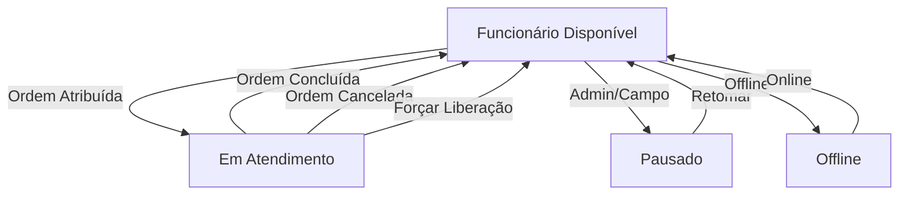

# Sistema de Monitoramento de Funcionários em Tempo Real

## 📋 Visão Geral

Sistema completo de monitoramento em tempo real do status dos funcionários em campo, com controle automático de disponibilidade e integração total com ordens de serviço.

## ✨ Funcionalidades

### 🎯 Status dos Funcionários

O sistema gerencia 4 status diferentes:

- **Disponível** 🟢: Funcionário livre para receber novas ordens
- **Em Atendimento** 🟡: Funcionário executando uma ordem de serviço
- **Pausado** 🔵: Funcionário temporariamente pausado
- **Offline** ⚫: Funcionário offline/indisponível

### 🚫 Bloqueio Automático

- **Não permite** atribuir nova ordem a funcionário ocupado
- **Validação automática** antes de criar/atribuir ordens
- **Liberação automática** ao concluir ordem
- **Sincronização em tempo real** entre status e ordens

### ⏱️ Monitoramento em Tempo Real

- Atualização automática a cada **15 segundos**
- Contador de tempo de atendimento ao vivo
- Dashboard com estatísticas em tempo real
- Alertas visuais para funcionários ocupados

### 👨‍💼 Controles Administrativos

Administradores e Co-Admins podem:
- Visualizar status de todos os funcionários
- Forçar liberação de funcionários (emergência)
- Atribuir e encerrar ordens
- Monitorar tempo de atendimento
- Ver histórico de atividades

## 🏗️ Arquitetura

### Migration

```php
// database/migrations/2025_12_06_000001_add_status_em_campo_to_funcionarios_table.php
- status_campo: 'disponivel', 'em_atendimento', 'pausado', 'offline'
- ordem_servico_atual_id: FK para ordens_servico
- atendimento_iniciado_em: Timestamp início do atendimento
- ultima_atualizacao_status: Timestamp última atualização
```

### Model: Funcionario

**Novos métodos:**

```php
// Verificações
$funcionario->estaDisponivel()      // Verifica se está disponível
$funcionario->estaEmAtendimento()   // Verifica se está em atendimento

// Ações
$funcionario->iniciarAtendimento($ordemId)  // Inicia atendimento
$funcionario->finalizarAtendimento()        // Finaliza atendimento
$funcionario->pausarAtendimento()           // Pausa status

// Accessors
$funcionario->tempo_atendimento       // Retorna "2h 30min"
$funcionario->status_campo_texto      // Retorna "Em Atendimento"
$funcionario->status_campo_cor        // Retorna "warning"

// Scopes
Funcionario::disponiveis()->get()     // Apenas disponíveis
Funcionario::emAtendimento()->get()   // Apenas em atendimento
Funcionario::ocupados()->get()        // Não disponíveis
```

### Service: FuncionarioStatusService

```php
$service = app(\Modules\Funcionarios\App\Services\FuncionarioStatusService::class);

// Verificar disponibilidade
$resultado = $service->podeReceberOrdem($funcionarioId);
// ['pode' => true/false, 'motivo' => 'string']

// Iniciar atendimento
$resultado = $service->iniciarAtendimento($funcionarioId, $ordemId);

// Finalizar atendimento
$resultado = $service->finalizarAtendimento($funcionarioId, $ordemId);

// Cancelar atendimento
$resultado = $service->cancelarAtendimento($funcionarioId, $motivo);

// Forçar liberação (Admin)
$resultado = $service->forcarLiberacao($funcionarioId, $motivo);

// Estatísticas
$stats = $service->getEstatisticas();
// ['total', 'disponiveis', 'em_atendimento', 'pausados', 'offline']

// Funcionários em atendimento
$emAtendimento = $service->getFuncionariosEmAtendimento();
```

### Observer: OrdemServicoStatusObserver

Automação completa:

```php
// Ao iniciar ordem → Marca funcionário como "em_atendimento"
// Ao concluir ordem → Marca funcionário como "disponivel"
// Ao cancelar ordem → Marca funcionário como "disponivel"
// Ao mudar funcionário → Atualiza ambos os status
```

## 🎨 Interface

### Painel de Monitoramento

**Rota:** `/admin/funcionarios/status`

**Recursos:**
- Cards de estatísticas em tempo real
- Tabela com todos os funcionários
- Badges de status coloridos
- Tempo de atendimento ao vivo
- Botão "Forçar Liberação"
- Auto-refresh a cada 15s

**Componentes:**

```blade
<!-- Badge de Status -->
<x-funcionarios::status-badge :funcionario="$funcionario" />

<!-- Alerta de Em Atendimento -->
<x-funcionarios::alerta-em-atendimento :funcionario="$funcionario" />
```

## 🚀 Como Usar

### 1. Executar Migration

```bash
php artisan migrate
```

### 2. Acessar Painel de Monitoramento

- **Admin:** `/admin/funcionarios/status`
- **Co-Admin:** `/co-admin/funcionarios/status`

### 3. Atribuir Ordem

Ao atribuir uma ordem a um funcionário:

```php
// No Controller de Ordens
use Modules\Funcionarios\App\Services\FuncionarioStatusService;

public function atribuir(Request $request, $ordemId)
{
    $statusService = app(FuncionarioStatusService::class);
    
    // Verificar se pode receber
    $verificacao = $statusService->podeReceberOrdem($request->funcionario_id);
    
    if (!$verificacao['pode']) {
        return back()->with('error', $verificacao['motivo']);
    }
    
    // Atribuir ordem...
    // O Observer cuidará do resto automaticamente
}
```

### 4. Iniciar Atendimento (Campo)

```php
// CampoOrdensController
public function iniciar($id)
{
    $ordem = OrdemServico::findOrFail($id);
    
    // Iniciar atendimento
    $ordem->update([
        'status' => 'em_execucao',
        'data_inicio' => now(),
    ]);
    
    // Observer atualiza o status do funcionário automaticamente!
}
```

### 5. Concluir Ordem

```php
public function concluir($id)
{
    $ordem = OrdemServico::findOrFail($id);
    
    $ordem->update([
        'status' => 'concluida',
        'data_conclusao' => now(),
    ]);
    
    // Observer libera funcionário automaticamente!
}
```

### 6. Forçar Liberação (Admin)

Interface gráfica no painel ou via código:

```php
$statusService->forcarLiberacao($funcionarioId, 'Emergência médica');
```

## 📡 API AJAX

### Atualizar Dados em Tempo Real

```javascript
// GET /admin/funcionarios/status/atualizar
fetch('/admin/funcionarios/status/atualizar')
    .then(response => response.json())
    .then(data => {
        console.log(data.estatisticas);
        console.log(data.funcionarios);
        console.log(data.funcionarios_em_atendimento);
    });
```

### Obter Detalhes de Funcionário

```javascript
// GET /admin/funcionarios/status/{id}/detalhes
fetch('/admin/funcionarios/status/123/detalhes')
    .then(response => response.json())
    .then(data => {
        console.log(data.funcionario);
    });
```

## 🔒 Regras de Negócio

### Validações Automáticas

1. ❌ **Não pode** atribuir nova ordem a funcionário em atendimento
2. ❌ **Não pode** atribuir ordem a funcionário pausado ou offline
3. ✅ **Pode** forçar liberação (apenas Admin)
4. ✅ **Automaticamente** libera ao concluir ordem
5. ✅ **Automaticamente** ocupa ao iniciar ordem

### Fluxo Completo



## 🎯 Casos de Uso

### Caso 1: Atendimento Normal

1. Funcionário está "Disponível"
2. Admin atribui ordem
3. Funcionário inicia atendimento → Status: "Em Atendimento"
4. Funcionário conclui ordem → Status: "Disponível"

### Caso 2: Emergência

1. Funcionário está "Em Atendimento"
2. Admin precisa liberar urgentemente
3. Admin clica "Forçar Liberação"
4. Funcionário liberado, ordem volta para "Pendente"

### Caso 3: Tentativa de Atribuição Inválida

1. Funcionário está "Em Atendimento"
2. Admin tenta atribuir nova ordem
3. Sistema bloqueia com mensagem: "Funcionário está em atendimento da OS #123"
4. Admin vê qual ordem está sendo atendida

## 📊 Relatórios e Logs

Todos os eventos são registrados:

```php
Log::info("Atendimento iniciado", [
    'funcionario_id' => 1,
    'ordem_servico_id' => 123,
]);

Log::info("Atendimento finalizado", [
    'funcionario_id' => 1,
    'ordem_servico_id' => 123,
    'tempo_execucao' => 45, // minutos
]);
```

## 🔍 Troubleshooting

### Problema: Funcionário travado em "Em Atendimento"

**Solução:**
```php
// Via Admin Panel: Forçar Liberação
// Ou via código:
$funcionario = Funcionario::find($id);
$funcionario->finalizarAtendimento();
```

### Problema: Status não atualiza automaticamente

**Verificar:**
1. Observer está registrado no ServiceProvider?
2. JavaScript está carregando?
3. Rota `/admin/funcionarios/status/atualizar` está acessível?

### Problema: Não permite atribuir ordem

**Verificar:**
```php
$verificacao = $statusService->podeReceberOrdem($funcionarioId);
dd($verificacao); // Ver o motivo
```

## 🎨 Personalização

### Cores dos Status

Edite em `components/status-badge.blade.php`:

```php
$statusClasses = [
    'disponivel' => 'bg-emerald-100 text-emerald-800',
    'em_atendimento' => 'bg-amber-100 text-amber-800',
    // ...
];
```

### Intervalo de Atualização

Edite no JavaScript (padrão: 15s):

```javascript
// Em admin/status/index.blade.php
updateInterval = setInterval(() => {
    atualizarDados();
}, 15000); // Altere este valor
```

## 📝 Changelog

### v1.0.0 - 2025-12-06

- ✅ Sistema de status em tempo real implementado
- ✅ Bloqueio automático de atribuições
- ✅ Monitoramento com auto-refresh
- ✅ Observer para automação
- ✅ Service completo
- ✅ Interface Admin e Co-Admin
- ✅ Componentes Blade
- ✅ API AJAX
- ✅ Documentação completa

## 👨‍💻 Desenvolvedor

**Reinan Rodrigues**  
CEO - Vertex Solutions © 2025  
E-mail: r.rodriguesjs@gmail.com

---

**VERTEXSEMAGRI** - Sistema de Gestão Municipal  
Desenvolvido com ❤️ por **Vertex Solutions LTDA**

