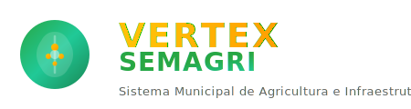
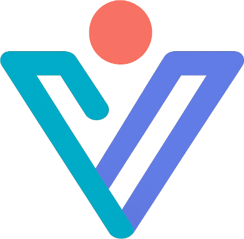

   
  
   
   

  <h1>VERTEXSEMAGRI</h1>
  <h3>Sistema Privado de Infraestrutura & Gestão Pública</h3>

  

    
    
    
    
  

 

  
🚨 <strong>ATENÇÃO: Este software é propriedade exclusiva da Vertex Solutions LTDA.</strong> 🚨

  
O uso, cópia, distribuição ou modificação não autorizada deste código é estritamente proibido.

---

## 📋 Sobre o Sistema

O **VERTEXSEMAGRI** é uma solução corporativa de alto desempenho para gestão municipal. Integra marketplace financeiro, operações de campo (PWA) e administração pública em um ambiente seguro e auditável.

---

## 🚀 Módulos & Funcionalidades (Enterprise)

### 💧 Marketplace Financeiro
- **Efipay Split Engine**: Motor financeiro proprietário para divisão de receitas em tempo real.
- **Auditoria Automática**: Rastreabilidade completa de todas as transações PIX.

### 📱 PWA Campo Pro
- **Tecnologia Offline-First**: Sincronização avançada para operações rurais sem conectividade.
- **Assinatura Digital**: Validação biométrica e assinatura em ordens de serviço.

### 🛡️ Segurança Corporativa
- **RBAC Granular**: Controle de acesso baseado em funções (Spatie).
- **Logs de Auditoria**: Registro imutável de ações administrativas.
- **Criptografia**: Dados sensíveis protegidos em repouso e trânsito.

---

## 💼 Informações Comerciais

Este software é licenciado sob contrato comercial. Para suporte técnico ou informações sobre licenciamento:

| Canal | Contato |
| :--- | :--- |
| **Comercial** | `comercial@vertexsolutions.com.br` |
| **Suporte Técnico** | `suporte@vertexsolutions.com.br` |
| **Plantão WhatsApp** | `+55 75 99203-4656` |

---

   

  ## 👨‍💻 Equipe de Desenvolvimento

  

  <h3>Vertex Solutions</h3>
  
<em>Inovação em Gestão Pública & Tecnologia</em>

   

  | **Desenvolvedor Líder** | **Reinan Rodrigues** |
  | :--- | :--- |
  | **Cargo** | CEO / Full-Stack Architect |
  | **Email** | [r.rodriguesjs@gmail.com](mailto:r.rodriguesjs@gmail.com) |
  | **WhatsApp** | [+55 75 99203-4656](https://wa.me/5575992034656) |

   

  
© 2026 Vertex Solutions. Todos os direitos reservados.

  
<em>Proibida a cópia ou redistribuição sem autorização expressa.</em>

